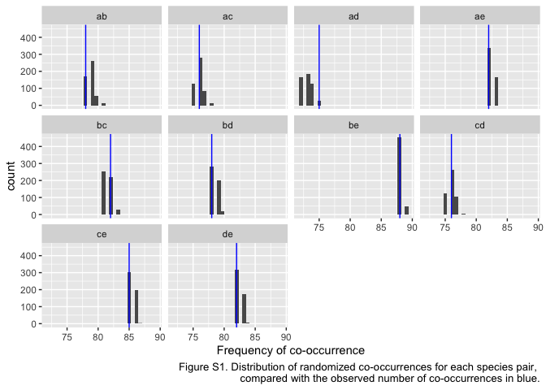

# Example implementation of the Sfenthourakis et al. (2006) COOC algorithm


## The COOC algorithm

Sfenthorakis et al. (2006) created an algorithm to detect significant pairwise checkerboard patterns from the frequency distribution of observed co-occurrences. This method was originally implemented to pair with the co-occurrence software EcoSim<a href="#note1" id="note1ref"><sup>1</sup></a>. We used functions from the `vegan` package in R version 3.4.0 (Oksanen et al. 2017, R Core Team 2017) to replicate this algorithm. The code can be found in the file 'COOC_algorithm.R', while an example implementation is found below.


## Example implementation


```r
library(vegan)
```

To get started, import data as a site x species community matrix, with surveyed sites in rows and species in columns. Columns (species) should be named and there should be fewer species than samples (sites). For this example, we will simulate random presence-absence community data.

```r
sites <- 100
species <- 5
p_presence <- 0.9
DATA <- matrix(nrow = sites,
               ncol = species, rbinom(sites * species, 1, p_presence))
colnames(DATA) <- letters[1:species]
```

Next, we will count how many times each pairs of species co-occurs in the data, across all sites. This is the "frequency" component of the frequency distribution method. First, enumerate all possible pairs of species in the data.


```r
combpairs <- function(x) {apply(combn(x, 2), 2, paste, sep = "", collapse = "")}
allpairs <- combpairs(colnames(DATA))
```

Create an empty data frame with the observed co-occurrence of each species pair (in rows) across each site (now in columns).

```r
NR <- length(allpairs)
coocbyrow <- matrix(nrow = NR, ncol = nrow(DATA))
row.names(coocbyrow) <- allpairs
```

Fill this empty data frame with the observed combinations in the data.

```r
for (i in 1:nrow(DATA)) {
  # which combinations are present in this site (row)
  temp <- combpairs(colnames(DATA)[which(DATA[i, ] == 1)])
  coocbyrow[, i] <- ifelse(row.names(coocbyrow) %in% temp, 1, 0)
}
```

Tally the total co-occurrences across all sites for each pair.

```r
obs.cooc <- apply(X = coocbyrow, MARGIN = 1, FUN = sum)
```

Compare the frequency of observed pairwise co-occurrences to a null model, using `permatswap()` from the `vegan` package, following the implementation by Sfenthourakis et al. of the sequential swap randomization algorithm.

```r
nperm <- 500
nul <-permatswap(DATA, fixedmar = "both", mtype = "prab",
                 # use sequential swap algorithm
                 method = "swap", 
                 times = nperm)

# for each one, count the null co-occurrences
expc.cooc <- matrix(nrow = NR, ncol = nperm)
# note: below nested for-loop is slow
for (i in 1:nperm) {
  tmp <- nul$perm[[i]]
  coocbyrow <- matrix(nrow = NR, ncol = nrow(DATA))
  row.names(coocbyrow) <- allpairs
  for (j in 1:nrow(tmp)) {
    temp <- combpairs(colnames(tmp) [which(tmp[j, ] == 1)])
    coocbyrow[, j] <- ifelse(row.names(coocbyrow) %in% temp, 1, 0)
  }
  expc.cooc[, i] <- apply(X = coocbyrow, MARGIN = 1, FUN = sum)
}
row.names(expc.cooc) <- allpairs
```

Finally, test the significance of the difference between observed co-occurrence and expected (null) co-occurrence. Sfenthourakis et al. (2006) use a chi-square test (alpha = 0.05) of significance. For this randomly-generated community data, we did see significant co-occurrence patterns compared to the null model (Fig. S1), as would be expected.

<!-- -->

## References

Oksanen,J., F. G. Blanchet, M. Friendly, R. Kindt, P. Legendre, D. McGlinn, P. R. Minchin, R. B. O'Hara, G. L. Simpson, P. Solymos, M. Henry H. Stevens, E. Szoecs and H. Wagner. 2017. vegan: Community Ecology Package. R package version 2.4-3. URL: https://CRAN.R-project.org/package=vegan

R Core Team. 2017. R: A language and environment for statistical computing. R Foundation for Statistical Computing, Vienna, Austria. URL: https://www.R-project.org/.

Sfenthourakis, S., E. Tzanatos, and S. Giokas. 2006. Species co-occurrence: the case of congeneric species and a causal approach to patterns of species association. Global Ecology and Biogeography 15:39–49. doi: [10.1111/j.1466-822X.2005.00192.x](doi.org/10.1111/j.1466-822X.2005.00192.x)

<a id="note1" href="#note1ref"><sup>1</sup></a>EcoSim was first developed by Gotelli & Entsminger 1997, and while the freely-available version is no longer supported, many of the functions can now be downloaded as part of the R package `EcoSimR`.


